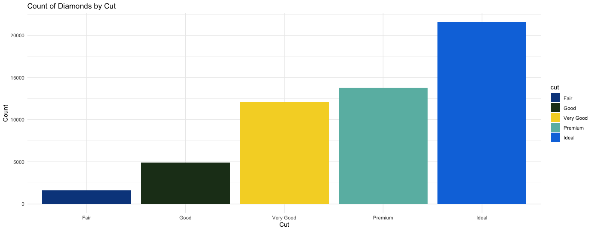
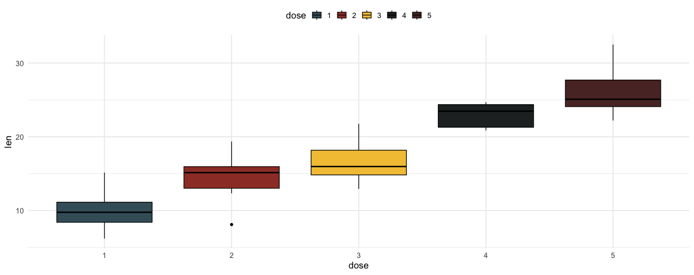

# harlem

<!-- badges: start -->
[](https://github.com/sdhutchins/harlem/actions)
[](https://opensource.org/licenses/MIT)
<!-- badges: end -->

Each palette draws from the colors of a specific artwork:

- **Jacob Lawrence** – *Street Scene* (`LawrenceStreetScene`)  
- **Romare Bearden** – *Conjur Woman* (`BeardenConjurWoman`), *Collage* (`BeardenCollage` if included)  
- **Aaron Douglas** – *Aspects of Negro Life* (`DouglasAspects`), *Song of the Towers* (`DouglasSongTowers`)  
- **Archibald Motley** – *Blues* (`MotleyBlues`), *Nightlife* (`MotleyNightlife`)  
- **William H. Johnson** – *Harlem* (`JohnsonHarlem`), *Going to Church* (`JohnsonGoingChurch`), *Ascent of Ethiopia* (`JonesAscentEthiopia`)  
- **Loïs Mailou Jones** – *La Baker* (`JonesLaBaker`), *Ascent of Ethiopia* (`JonesAscentEthiopia`)  
- **Sargent Claude Johnson** – *Octoroon Girl* (`SargentOctoroonGirl`)  
- **Beauford Delaney** – *Self-Portrait* (`DelaneySelfPortrait`)  
- **Palmer Hayden** – *Fetiche et Fleurs* (`HaydenFetiche`)  
- **Charles White** – *Soldier* (`CharlesWhiteSoldier`)  
- **Hale Woodruff** – *The Amistad Mutiny* (`WoodruffAmistad`)

By using these palettes, you can incorporate the vibrancy, contrast, and cultural context of Harlem Renaissance art directly into your ggplot2 charts or other R visualizations.

## Installation

You can install the development version of `harlem` from [GitHub](https://github.com/) with:

``` r
# install.packages("devtools")
devtools::install_github("sdhutchins/harlem")
```

## Examples

Below are sample visualizations with a few of these palettes.

### Example 1: Density Plot Using the "Motley Blues" Palette
```r
# ggplot2 library
library(ggplot2)
 
# Let's use the diamonds dataset
data(diamonds)
head(diamonds)

# basic example code
palette <- harlem_palettes$MotleyBlues
ggplot(data=diamonds,aes(x=price, group=cut, fill=cut)) + 
  geom_density(adjust=1.5, alpha=.8) +
  scale_fill_manual(values = palette) +
  theme_minimal()
```


### Example 2: Bar Plot Using the "Charles White Soliders" Palette

```r
# ggplot2 library
library(ggplot2)
 
# Let's use the diamonds dataset
data(diamonds)
head(diamonds)

palette <- harlem_palettes$JonesAscentEthiopia
ggplot(data=diamonds, aes(x=cut, fill=cut)) + 
    geom_bar() +
    scale_fill_manual(values = palette) +
    theme_minimal() +
    labs(title="Count of Diamonds by Cut", x="Cut", y="Count")
```


### Example 3: Box Plot Using the "Charles White Soldier" Palette

```r
set.seed(123)
df <- data.frame(
    dose = factor(rep(1:5, each = 10)),
    len = c(rnorm(10, 10, 3),
            rnorm(10, 14, 3),
            rnorm(10, 18, 3),
            rnorm(10, 22, 3),
            rnorm(10, 26, 3))
)

# Box plot
ggplot(df, aes(x = dose, y = len, fill = dose)) +
    geom_boxplot(color = "black") +
    scale_fill_manual(values = harlem_palettes$CharlesWhiteSoldier) +
    theme_minimal(base_size = 14) +
    theme(legend.position = "top") +
    labs(x = "dose", y = "len")
```


## List of Palettes

You can view the list of available palettes with:
```r
names(harlem_palettes)
```

## View Palettes as a Plot in R

```r
print_palette(harlem_palettes$MotleyBlues)
```

## Contributing

If you would like to contribute to this package, please see the CONTRIBUTING.md guidelines.


