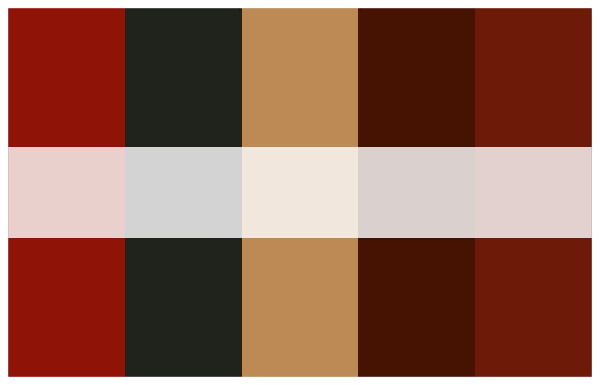

# Using harlem color palettes

The `harlem` package provides color palettes inspired by Harlem
Renaissance artworks. Use them in base R plots or with `ggplot2`.

### Available palettes

``` r
names(harlem_palettes)
#>  [1] "LawrenceStreetScene" "BeardenConjurWoman"  "DouglasAspects"     
#>  [4] "MotleyBlues"         "JohnsonHarlem"       "SargentOctoroonGirl"
#>  [7] "DelaneySelfPortrait" "JonesLaBaker"        "HaydenFetiche"      
#> [10] "MotleyNightlife"     "JonesAscentEthiopia" "CharlesWhiteSoldier"
#> [13] "DouglasSongTowers"   "JohnsonGoingChurch"  "LoisMailouJones"    
#> [16] "WoodruffAmistad"
```

### Preview a palette

``` r
print_palette(harlem_palettes$MotleyBlues)
```



### Discrete example (bar plot)

``` r
# Use a discrete palette directly
palette <- harlem_palettes$JonesAscentEthiopia

# Diamonds bar chart colored by cut
p1 <- ggplot(diamonds, aes(x = cut, fill = cut)) +
  geom_bar() +
  scale_fill_manual(values = palette) +
  theme_minimal() +
  labs(title = "Count of diamonds by cut",
       x = "Cut", y = "Count")

p1
```


### Continuous example (scatter plot)

``` r
# Build a continuous gradient from a palette
continuous_cols <- harlem_palette("MotleyBlues", n = 256, type = "continuous")

# Use a scatter plot to demonstrate continuous color scale
subset_diamonds <- diamonds[sample.int(nrow(diamonds), 2000), ]

p2 <- ggplot(subset_diamonds, aes(x = carat, y = price, color = price)) +
  geom_point(alpha = 0.6, size = 1.2) +
  scale_color_gradientn(colors = continuous_cols) +
  theme_minimal() +
  labs(title = "Scatter with continuous palette",
       x = "Carat", y = "Price", color = "Price")

p2
```


